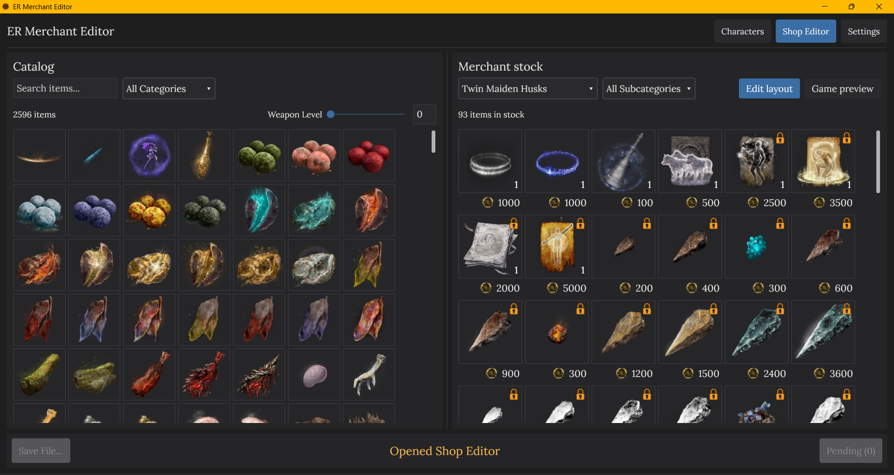
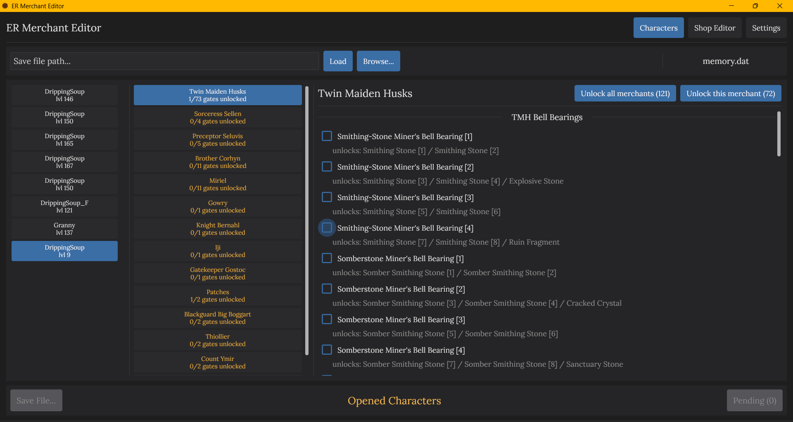
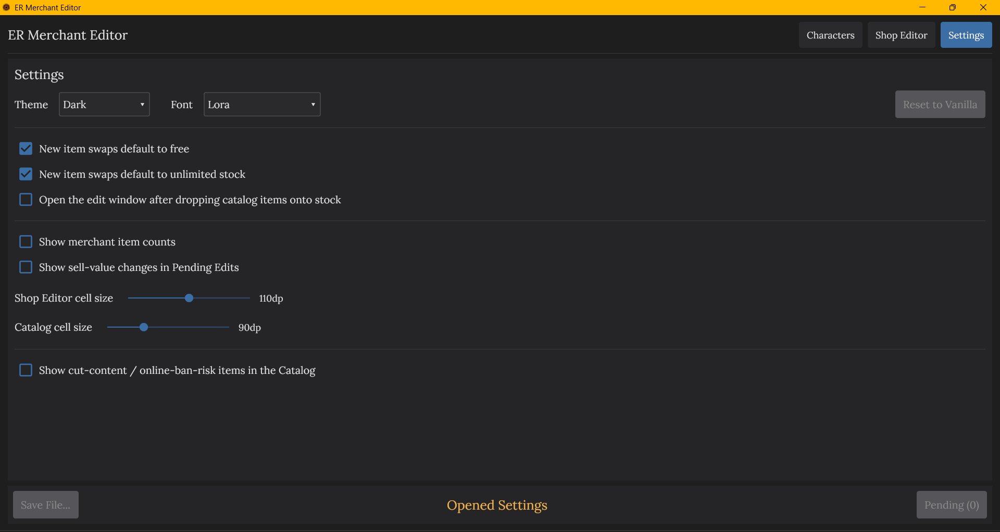

# ER Merchant Editor

ER Merchant Editor is a free desktop save editor for **Elden Ring on PS4 and
PS5**. It changes existing merchant stock: choose one of the game's 43
merchants, replace items, adjust prices and quantities, set weapon levels, and
unlock progression-gated stock for individual characters.

The application is available for **Windows and Linux**. Its editor core is
platform-independent; macOS is future work and is not currently distributed.

**[Download the latest release →](../../releases/latest)**

## Read this first

- **Always keep an untouched backup.** Never experiment on your only save.
- The input must already be decrypted. PlayStation's outer save encryption and
  signing are separate from this editor; use an appropriate third-party tool to
  decrypt the save before editing and to prepare it for the console afterward.
- Changes are staged and written to a new file. The selected input file is
  never overwritten.
- Cut-content and online-ban-risk items are hidden by default. Enabling them
  does not make them safe for online use.

### Important: applying changes while playing online

When Elden Ring connects online on PlayStation, the server restores merchant
settings to vanilla the first time a character is loaded. To make the edited
merchant stock appear:

1. Start Elden Ring and load the character.
2. Exit that character back to the title menu **without closing the game**.
3. Load the character again in the same game session.

The changes appear after the second character load. Do not close Elden Ring
between steps 2 and 3.

## Quick start

1. Download and run the Windows `.exe`, or extract the Linux archive and run
   `ERMerchantEditor`.
2. Make a backup, then decrypt the PlayStation save with your usual save tool.
3. Paste or browse to the decrypted `.dat` file and select **Load**.
4. Make your changes. **Pending (N)** shows everything waiting to be written;
   review or remove edits there at any time.
5. Select **Save File...** and choose a new destination.
6. Prepare the output for your console with the same external save workflow.
   If you play online, follow the two-load procedure above.

Before an output file is created, the editor rebuilds the save and verifies it
with a byte-exact round trip. A failed verification produces an error instead
of a potentially damaged save.

## Features

### Shop Editor

Browse the complete item catalog on the left and the selected merchant's stock
on the right.

<p align="center">
  
</p>

- Replace a stock item by clicking its slot or dragging from the catalog.
- Select several catalog items with Ctrl/Shift and fill consecutive slots with
  a live preview of the affected cells.
- Set price and quantity (`-1` means unlimited stock).
- Set weapon and shield reinforcement levels, clamped to their real maximum:
  +10 for somber equipment and +25 for standard equipment.
- Rearrange stock by dragging one merchant slot onto another.
- Switch between a stable editing layout and the order shown in-game.
- Right-click an item for its stats, requirements, scaling, FP cost, slots, or
  Ash of War details where applicable.
- Search and filter by category and subcategory.

### Characters

Inspect each character slot and the merchant stock that character has actually
unlocked.

<p align="center">
  
</p>

- Unlock or relock supported progression-gated stock for one character.
- Apply an unlock to every character by acting with no character selected.
- Inspect Twin Maiden Husks bell bearings and other merchants in their in-game
  shop groups.
- See lock badges based on the currently selected character's real state.

### Settings

Choose Dark, Light, or Elden Ring themes; change fonts and cell sizes; configure
default replacement prices; control risky-item visibility; or stage a **Reset
to Vanilla** for merchant rows.

<p align="center">
  
</p>

## Limitations

- The editor changes **existing merchant rows**; it cannot add inventory slots.
  A single merchant therefore cannot be made to sell every item in the game.
- It does not decrypt, encrypt, or sign the outer PS4/PS5 save container.
- Reset to Vanilla restores merchant-row data, not character progression flags
  written during an earlier session.
- No modified save can be guaranteed risk-free for online play.

See [Project status and scope](docs/PROJECT.md) for the underlying format limits.

## Building from source

The required Go version is declared in `go.mod`. `GOTOOLCHAIN=auto` can fetch
it, and the first build may also need to download module dependencies.

```sh
scripts/build.sh              # build GUI targets supported by this host
go run ./cmd/ermerchanteditor # run the GUI directly
```

Windows cross-compiles without cgo. Linux releases are built and tested
natively; see [Packaging and releases](docs/PACKAGING.md) for dependencies and
artifact layout.

## Technical documentation

The editor decrypts the save's embedded regulation data, extracts and
decompresses `regulation.bin`, patches the relevant param tables, recompresses
and re-encrypts the data, and splices the verified result into a new save—all
in-process.

- [Architecture](docs/ARCHITECTURE.md)
- [Project status and data flow](docs/PROJECT.md)
- [Merchant save format](docs/MERCHANT_DATA.md)
- [Shop lineup rows](docs/SHOP_LINEUP.md)
- [Merchant mapping](docs/MERCHANTS.md)
- [Write and verification pipeline](docs/WRITEBACK.md)
- [Character unlock flags](docs/CHAR_UNLOCK.md)
- [GUI behavior](docs/EDITOR.md)

## License and attribution

GPLv3 — see [LICENSE](LICENSE). The project was relicensed from MIT on
2026-07-28 to permit adapting event-flag save-format data and logic from the
GPLv3-licensed
[EldenRing-SaveForge](https://github.com/oisis/EldenRing-SaveForge) project;
see [SaveForge attribution](docs/SAVEFORGE_REFERENCE.md). Item icons are
vendored from that project. Param definitions come from
[soulsmods/Paramdex](https://github.com/soulsmods/Paramdex).

ER Merchant Editor is not affiliated with FromSoftware or Bandai Namco.
